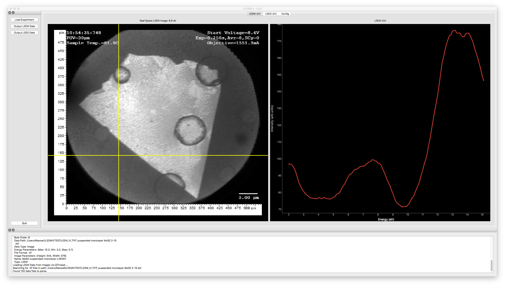
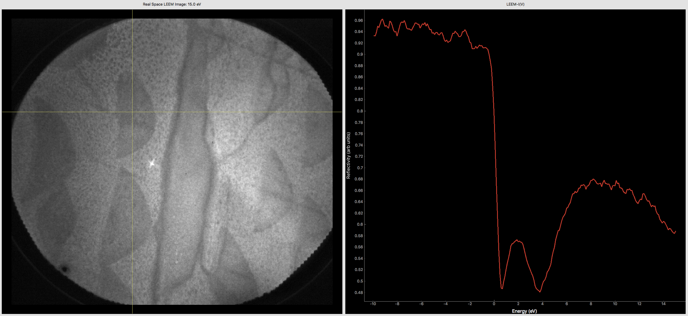
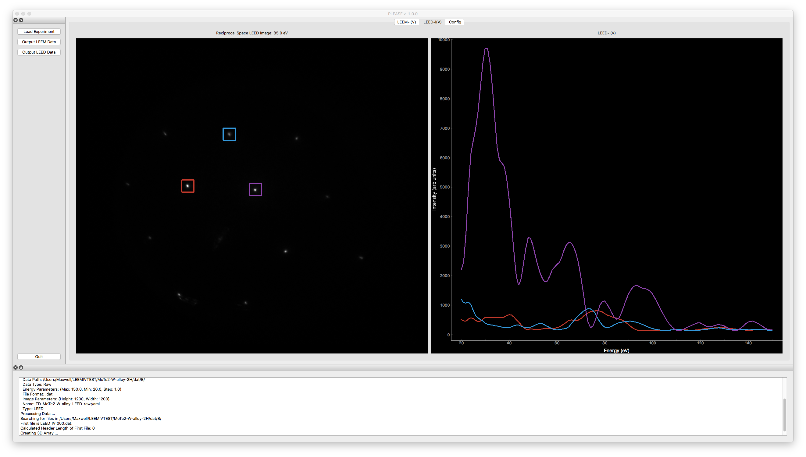

# PLEASE
PLEASE: The Python Low-energy Electron Analysis SuitE - Enabling rapid analysis and visualization of LEEM and LEED Data.

### Author: Maxwell Grady
### Affiliation: University of New Hampshire Department of Physics
### Current Version: 1.0.0

# What is it?
The **PLEASE** software package provides an open source cross platform graphical user interface for rapid analysis and visualization of Low Energy Electrom Microscopy (LEEM) and selected area micro-spot size Low Energy Electron Diffraction (µLEED) data sets. PLEASE is written in python using the PyQt and pyqtgraph python bindings for the Qt graphics framework.

# Why is it?
LEEM and µLEED are powerful techniques for surface analysis of many types of novel materials and are especially useful for the study of two-dimensional (2D) materials. Specific emphasis is placed on the analysis of Intensity-Voltage (IV) data sets. IV curves map the scattered or reflected electron intensity as a function of incident energy. The structure of these curves is inherently linked to the atomic surface structure of the target material. Given that the electronic properties of many 2D materials are linked to the surface structure, LEEM and µLEED provide unique avenues for the study of novel material properties in reduced dimensions and may help guide future application of these materials.

During my doctoral research I had the opportunity to be involved with a number of LEEM and µLEED experiments as well as the corresponding data analysis. At the time of this work, there were few if any open source solutions for analyzing LEEM and LEED data sets. Since the analysis routines for varying LEEM and µLEED experiments are essentially the same, I decided to write a piece of software to streamline the data analysis for my work and provide an easy to use interface for extraction of IV data from the experimental data. The project served a dual purpose to enhance my research group's capability to help with analysis for LEEM and µLEED experiments as well as to teach myself about scientific software development.

# What can it do?
PLEASE provides an easy interface for visualization of LEEM and LEED data sets while also providing a convenient user-friendly point-and-click method for extracting IV curves. Alongside the data extraction functionality, basic data transformation tools are provided to smooth the IV curves, reducing instrument noise, and subtract background signal from the IV data.

For both LEEM and LEED data sets, images are displayed on the lefthand side and to the right is a plot area for displaying I(V) curves. Arrow keys left and right can be used to change the current displayed image. Images are labeled according to the energy at which the data was acquired. **Figure 1** shows a screenshot of the full User interface with a LEEM data set loaded for analysis. The lefthand side of the interface provides a number of controls for loading data or outputting I(V) data to a text file. The bottom of the program contains a text widget which provides information about the data as it is loaded. The python stdout is rerouted to this widget so any error messages are displayed here rather than the command line where you executed the code from.

For LEEM data, the left hand side image area displays real space images of the sample surface. The UI tracks mouse movement within the image area with a crosshair and automatically extracts the I(V) curve from the current mouse location. The I(V) data extracted from the current location is plotted on the right hand side plot area. The plot shows the reflected electron intensity as a function of incident energy. The y axis can be rescaled to plot reflectivity rather than intensity. This is accomplished by a simple rescaling of all y values by dividing by the maximum observed intensity. **Figure 2** shows a LEEM-I(V) data set with a smoothed and rescaled I(V) plot to the right. The image displays graphene islands grown atop a ruthenium(0001) surface.

For LEED data, the data extraction is a bit more complex but still very straightforward for the User. Whereas LEEM I(V) curves are extracted from a single pixel extended through the entire image data set along the energy axis, LEED I(V) curves are extracted from a rectangular integration window of adjustable size. This allows the intensity of an entire beam spot to be analyzed rather than a single pixel. Rectangular selections are displayed atop the image on the left hand side upon mouse click. When all selections have been made, the User can select Extract-I(V) from the LEED menu to display the data on the right hand side plot. All selection areas and plotted curves are color coded so that curves from different selections can be easily distinguished. **Figure 3** shows a LEED-I(V) data set with three electron beams selected and extracted. The I(V) curves corresponding to these selections is displayed on the right.

Since LEEM and LEED data sets are collected with a wide range of experimental parameters, PLEASE provides an easy method for working with multiple data sets. Rather than having to input the experimental parameters each time data is loaded for analysis, the parameters are stored in a human readable structured text file using the YAML format. An example configuration file is provided with this source code. To setup a new data set for analysis, all that must be done is create a copy of the configuration template and fill in the required parameters. PLEASE can then load the experiment settings from the file and then load the data files accordingly.

#### The necessary info for loading data is as follows:
* Image parameters:
  * Image Height [integer]
  * Image Width [integer]
* Energy parameters (in eV):
  * Starting Energy [single decimal float i.e. 2.0]
  * Final Energy [single decimal float i.e. 2.0]
  * Step Energy [single decimal float i.e. 2.0]
* Data parameters:
  * Data Type [string] valid parameters are {"Image", "Raw"}
  * File format [string] {".tif", ".png", ".dat"}
  * Bit Depth (Required for loading raw data) [integer] valid parameters are {8, 16} for 8 and 16 bit data respectively
  * Byte Order (Required for loading raw data) [string] {"L" for little endian, "B" for big endian}
  * Data path [string pointing to folder containing data files]

An example file and instructions for creating your own experiment configuration files can be found in the subdirectory Experiment-YAML of this repository. Finally, a few test data sets are provided to ensure PLEASE is functioning properly. Each of these sets is accompanied by a .yaml experiemnt configuration file that must be edited with he correct data paths.

 # Contributing
 PLEASE was written and developed as a project for my doctoral research. As such, I am the only developer on the project. However, I welcome any and all contributions to this software package. I have included the main features which were relevant to my research, however, there will likely be more that I have missed. With each new experiment I became involved in, the software grew accordingly. However, I have been the primary tester for the software. I welcome others to try the software and provide feedback.

 Is there a feature you would love to see? Is there a bug that needs to be fixed? Do you have an alternate file format you would like to see supported?
 There are a number of options for addressing these issues. First and foremost, feel free to open an Issue on the main Github page. This is a great location for discussion about bugs, new features, file formats, etc...
 Second, You are welcome to fork the project and edit the code to suit your own needs. Finally, rather than forking the project to make your own edits, I welcome contributions to the codebase from users. For more information about how to contribute, please see the CONTRIBUTING.md file located in the main source tree.
